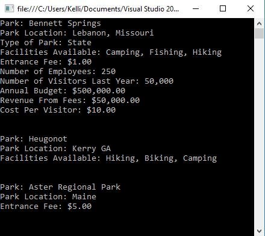

# National-Parks Exam 1
C# Application

## Assignment Details

There are a number of national and state parks available to tourists. Create a Park class. Include data members such as name of park, location, type of (i.e., national, state, and local) facility, fee, number of employees, number of visitors recorded for the past 12 months, and annual bud- get. Write separate instance methods that (1) return a string representing name of the park, the location, and type of park; (2) return a string representing the name of the park, the location, and facilities available; (3) compute cost per visitor based on annual budget and the number of visitors during the last 12 months; and (4) compute revenue from fees for the past year based on number of visitors and fee. Also include a ToString( ) method that returns all data members with appropriate labels. Create a second class to test your Park class.

Your class should have a minimum of 3 overload constructors

one should expect  the park name
one should expect the park name, location and facilities
one should expect the park name, the park location and the fees

## Output

